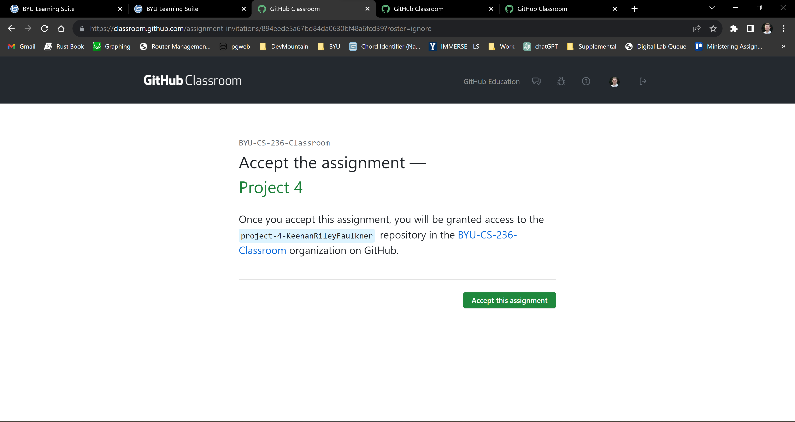
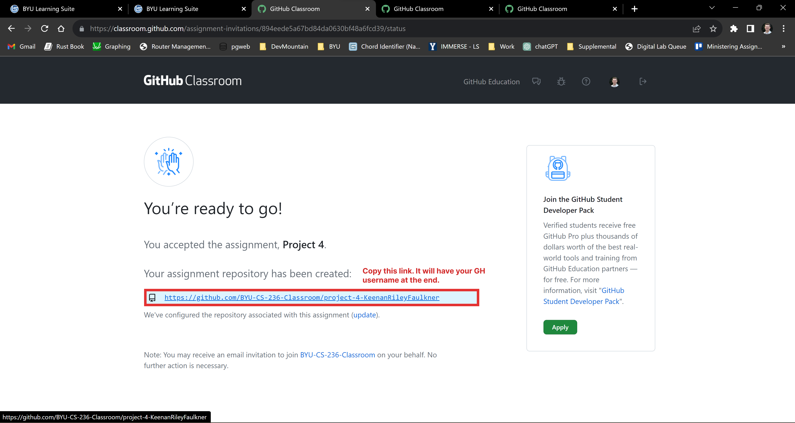
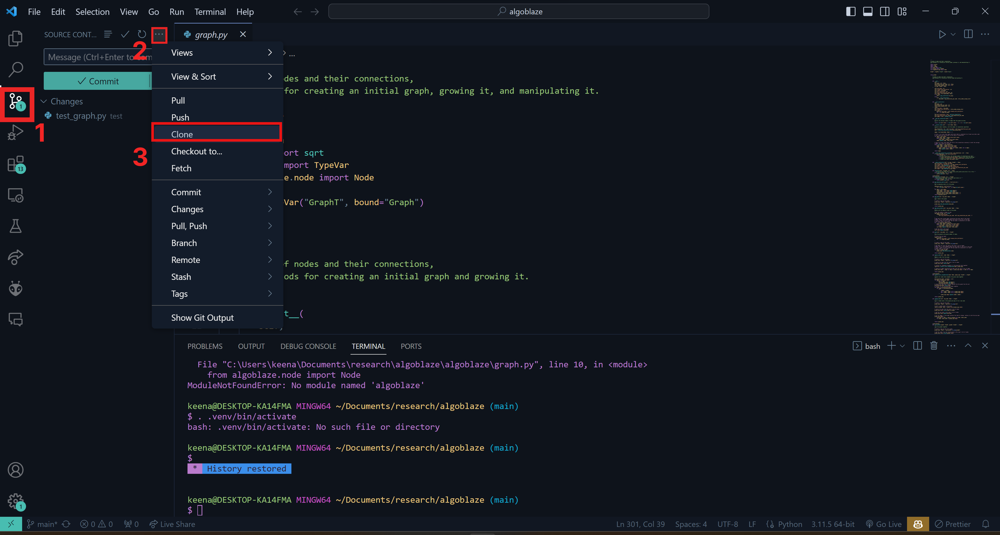
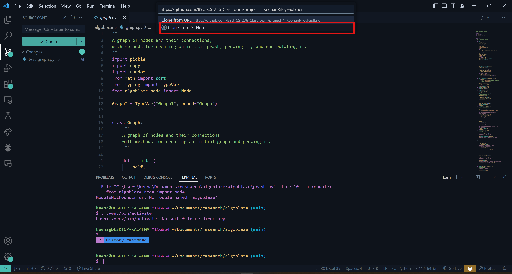

# Cheat Sheet for Common Tasks

## Testing Your Code:
You should ensure that your code passes all test cases locally before submitting it to Github. To do so, run the following command from the root directory of the project on the command line:  ```pytest test.py -v --tb=short --bucket=<bucketNum>``` where  ```<bucketNum>```  is the test bucket you want to run. For example,  ```pytest test.py -v --tb=short --bucket=80```  would run test bucket 80.

## Passing Off with Github

_We use Github actions to automatically check your code against the test cases and determine your grade on each project. To pass off with Github, do the following:_
1. Commit and push your code to Github by running the following commands in order from the root directory of the project on the command line: 

    ```git add . ```

    ```git commit -m "descriptive name of what you want to commit"```

    ```git push```

    Notice the period in the git add command. This tells git to add all relevant files to your commit.
2. Navigate to your remote repository on Github's website
3. Go to the _Pull requests_ tab of the repo
4. Click on the _Feedback_ pull request
5. Scroll to the bottom of the pull request page, click _Close pull request_, and then immediately click _Reopen pull request_

This will trigger Github Actions to check your code against the test cases. Once it is done running, you should see the results in the Actions tab of the repository. For further questions, consult the Project Passoff Instructions page under the Projects subsection of the CS236 classroom Github repository

## Cloning a Project

When you start working on any of the projects for this class, the first thing you will need to do is clone (or copy) the starter code from Github to your computer. There are a few steps to this: 

1. Visit the Github Classroom repository for the project you want called "Github Classroom Starter Code". For example, if I wanted to clone project 1, I would go to Classroom --> Projects --> Project 1  and find the link to the starter code on the readme. 

2. If you are asked to link your account to your BYU netid, find your netid in the list and do so.

3. You should be taken to a page that asks you to accept the assignment. Click the green button to do so.

Github will then begin creating a copy of the assignment starter code that is specific to you. It should only take a couple of seconds, so wait for a bit and then refresh the page. 
4. Copy the link that is generated in blue: 

5. Open a new VS Code window by navigating to the application the same as you would for opening Chrome, Discord, or any other app on your computer. You should have downloaded and installed VS Code as part of project 0.

6. Once VS Code is open, start a new terminal instance within VS Code by pressing  Ctrl + ~ . 

7. In the terminal make sure you are in the directory you would like to keep all your projects for the class in. You may need to make a new directory to hold the projects or navigate to that directory if you've already created it in the past. How to do this varies based on what type of computer you have. For Linux based Operating Systems, the command to create a new directory is ```mkdir <name_of_my_dir>``` and the command to change directories is  ```cd <path_to_my_dir>``` . If you use Windows or Mac OS, the command might vary slightly.

8. Once you are in the correct directory, and assuming you have already installed git, you can type  ```git clone <link_copied_from_github>```  which will copy your remote Github repository to your computer locally, and create a new sub-directory for it. Alternatively, you may clone the repository using VS Code's GUI by clicking the buttons as shown below:

After clicking "clone" you will be asked to provide the link you copied from Github. Paste it in, and click the "Clone from Github Button":

You will then be asked to log into Github, and then asked what folder you would like to clone your repo into on your computer.
9. Finally, remember to copy over relevant files from past projects for use in your new project!

## GitHub Auto-Grader Pass Off Support
### Error: Exit with code: 2 and signal: null
If you receive this error code in your GitHub auto-grading action under the "Run education/autograding@v1" tab, then it most likely means you are using a python library that hasn't been installed on the auto-grader or your GitHub repo is missing some of your class files. Examples of popular libraries in this class may be tabulate, typing, or sorted set. To fix this issue you need to follow these steps.

1. Verify all of your classes has been added to your GitHub repository. If some classes don't exist, add them, commit them, and push them to your GitHub repository and try again. If that doesn't work continue to the next step to add python libraries.

2. Open the .github/classroom/autograding.json file in vscode.

3. Notice each test object has an attribute "setup" and that setup attribute is set to a string. This string is the command we are giving to the auto-grader to install pip libraries. Note: it may be helpful to remove the "--no-header --no-summary -s" from the "run" attribute on each test to help with debugging on the GitHub actions page as it will show what is causing the error. The new run line would look like this,

    "run": "pytest test.py -v -vv --bucket=80",

4. We can add extra pip libraries to this string to download them to the auto-grader. Additional libraries should be added as they appear in PyPi, space separated, after the pytest library. For example, if I wanted to include tabulate and typing I would change the string to, "sudo -H pip3 install pytest tabulate typing".

5. Change the setup string for each test object.

6. Run git add, commit, and push to add your changes to GitHub.

7. If the error persists consider removing the imported libraries from your project or contacting a TA.